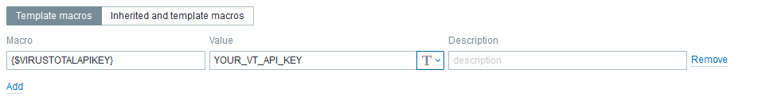
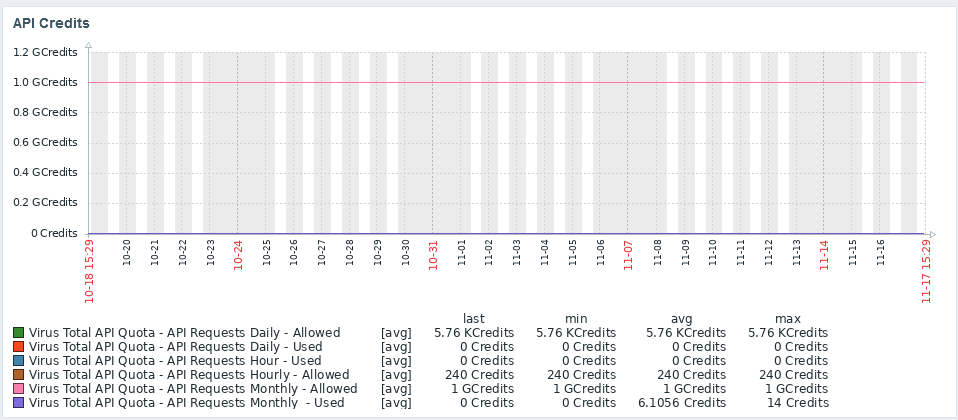
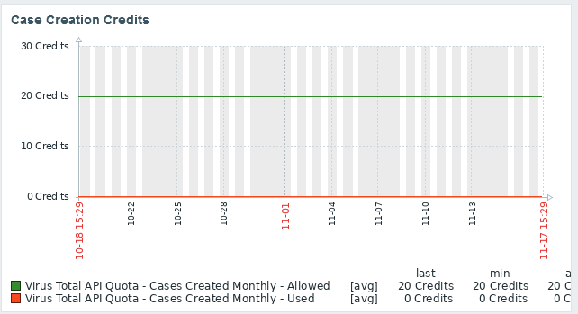
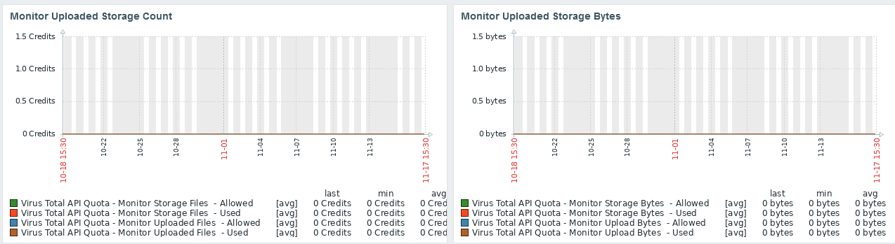
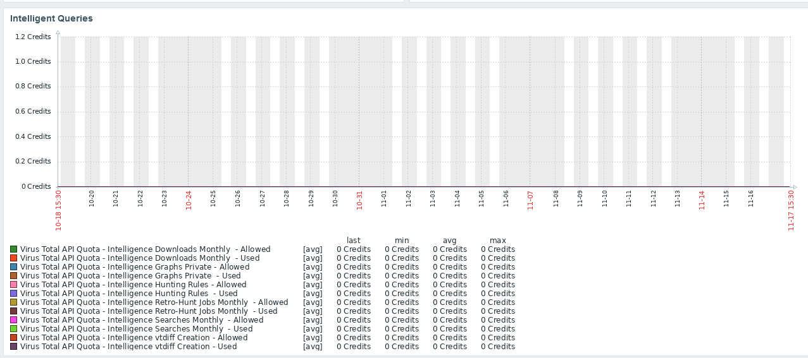

# Zabbix_VirusTotalAPIStatus
Zabbix Template for VirusTotal API account usage. Provides account info and API usage.

## Installation
Import Zabbix_VirusTotal-APIStatus.yaml (Zabbix Template)
Create Zabbix host
Link new Zabbix Template "VirusTotal API Provider"
Set macro "{$VIRUSTOTALAPIKEY}" to your VirusTotal API Key
Add agent interface (its necessary for the HTTP Agent to work, despite an actual "host" not being necessary.)

## Items
- VirusTotal User type
- VirusTotal API User Status
- VirusTotal User Reputation
- VirusTotal UserID
- VirusTotal User MFA Enabled
- USED / ALLOWED for all quotas:
  - Monitor Uploaded Files (Count)
  - Monitor Uploaded Files (Bytes)
  - Monitor Storage Files (Count)
  - Monitor Storage Files (Bytes)
  - Intelligence VTDiff Creation
  - Intelligence Searches
  - Intelligence Retro-Hunt Jobs
  - Intelligence Hunting Rules
  - Intelligence Graphs Private
  - Intelligence Downloads 
  - Cases Created
  - API Requests (Monthly)
  - API Requests (Daily)
  - API Requests (Hourly)

## Graphs
- API Requests - use/allowed
- Intelligence frameworks - used/allowed
- Monitored files uploaded/stored - used/allowed

## Triggers
- 75% Use and 100% use for all above listed quotas
- Plan change
- Account not active
- Account without MFA

## Tags
- Application:API
- VirusTotal:data (JSON)
- VirusTotal:Used (Credits Used)
- VirusTotal:Allowed (Credits Allowed)
- VirusTotal:Account (Account information)
- VirusTotal:IntelligentQueues (Intelligence Hunting Usage)
- VirusTotal:Cases (Case Submission Usage)
- VirusTotal:UploadMonitor (Upload Monitor Statistics)

## Triggers
Credits has reached zero
Change in account status
Account status is inactive

## Screenshots

Template Macros

Dashboard - API Credits - 30 days

Dashboard - Case Creation Credits - 30 days

Dashboard - Monitor Upload Stats - 30 days

Dashboard - Intelligent Queues Credits - 30 days

## Updates
- 11/17/2021 - Added screenshots; added tags; aded xml

## Contact
Twitter: @KRelkci
GitHub: @Relkci

## Special Thanks
Black Hills Information Security
https://www.blackhillsinfosec.com